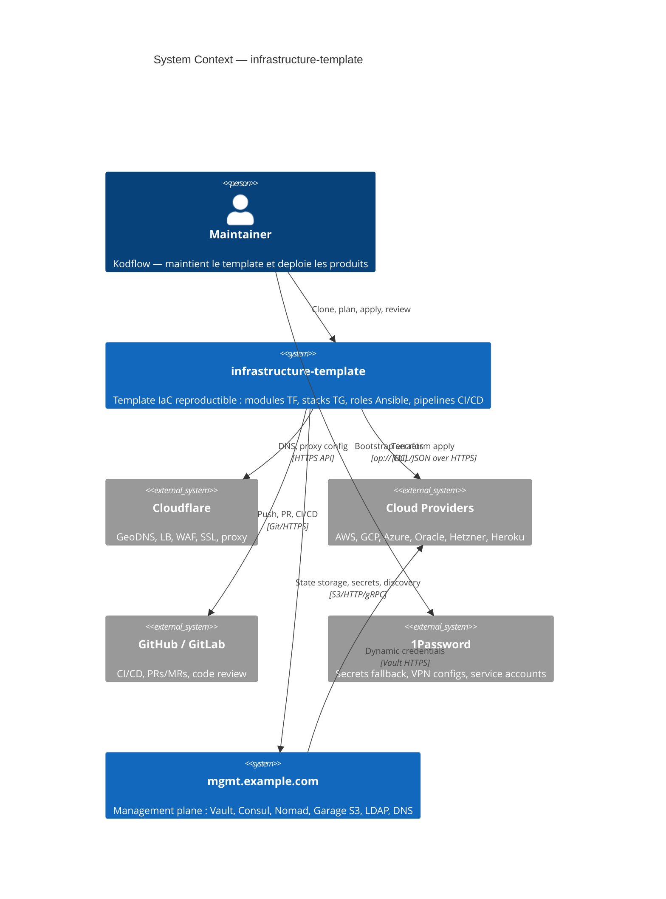

# Architecture

Vue progressive de l'architecture infrastructure-template, du contexte systeme aux composants internes.

## Navigation

| Niveau | Diagramme | Audience | Focus |
|--------|-----------|----------|-------|
| [Contexte](#system-context) | C4 Context | Tous | Le template dans son ecosysteme |
| [Composants](components.md) | C4 Container | Architectes | Modules, stacks, services |
| [Flux de donnees](flow.md) | Sequence | Developpeurs | Deploiement, secrets, state |

## System Context

### Interactions cles

| De | Vers | Protocole | Objectif |
|----|------|-----------|----------|
| Maintainer | Template | CLI local | `make plan`, `make apply`, `/git` |
| Template | Cloud Providers | HTTPS (Terraform) | Provisioning infrastructure |
| Template | mgmt.example.com | S3/HTTP | State TF, secrets Vault, discovery Consul |
| Template | GitHub/GitLab | Git/HTTPS | CI/CD pipelines, code review |
| Template | Cloudflare | HTTPS API | DNS, proxy, WAF configuration |
| mgmt | Cloud Providers | Vault HTTPS | Credentials dynamiques |
| Maintainer | 1Password | `op://` CLI | Bootstrap initial des secrets |

### Dependances externes

| Systeme | Type | Criticite |
|---------|------|-----------|
| Cloud Providers | Provisioning cible | Haute — sans provider, pas d'infra |
| mgmt.example.com | Management plane | Haute — state, secrets, discovery |
| Cloudflare | Edge/Proxy | Moyenne — fallback Let's Encrypt |
| 1Password | Secret bootstrap | Basse — fallback env vars |
| GitHub/GitLab | CI/CD | Moyenne — deploiement local possible |
