# Composants

## Vue d'ensemble

```mermaid
%%{init: {'theme': 'dark', 'themeVariables': {
  'primaryColor': '#9D76FB1a',
  'primaryBorderColor': '#9D76FB',
  'primaryTextColor': '#d4d8e0',
  'lineColor': '#d4d8e0',
  'textColor': '#d4d8e0',
  'secondaryColor': '#76fb9d1a',
  'secondaryBorderColor': '#76fb9d',
  'tertiaryColor': '#fb9d761a',
  'tertiaryBorderColor': '#fb9d76'
}}}%%
flowchart TB
  subgraph stacks["stacks/ (Terragrunt)"]
    mgmt["management<br/>vault+consul+nomad+garage+ldap"]:::primary
    edge["edge<br/>cloudflare+dns+ssl"]:::primary
    compute["compute<br/>network+compute+firewall"]:::primary
    vpn_stack["vpn<br/>openvpn+wireguard+pptp"]:::primary
  end

  subgraph modules["modules/ (Terraform)"]
    subgraph cloud["cloud/"]
      m_compute["compute"]:::primary
      m_network["network"]:::primary
      m_storage["storage"]:::primary
      m_dns["dns"]:::primary
    end
    subgraph services["services/"]
      m_vault["vault"]:::data
      m_consul["consul"]:::data
      m_nomad["nomad"]:::data
      m_garage["garage"]:::data
      m_ldap["ldap"]:::data
      m_cf["cloudflare"]:::external
      m_vpn["vpn"]:::primary
      m_tunnel["tunnel"]:::primary
      m_ssl["ssl"]:::primary
    end
    subgraph base["base/"]
      m_fw["firewall"]:::primary
      m_ssh["ssh"]:::primary
    end
  end

  mgmt --> m_vault & m_consul & m_nomad & m_garage & m_ldap & m_dns
  edge --> m_cf & m_dns & m_ssl
  compute --> m_network & m_compute & m_fw & m_ssh
  vpn_stack --> m_vpn

  classDef primary fill:#9D76FB1a,stroke:#9D76FB,color:#d4d8e0
  classDef data fill:#76fb9d1a,stroke:#76fb9d,color:#d4d8e0
  classDef async fill:#fb9d761a,stroke:#fb9d76,color:#d4d8e0
  classDef external fill:#6c76931a,stroke:#6c7693,color:#d4d8e0
```

## modules/cloud/ — Abstractions Provider

Chaque module expose une interface commune et implemente les specificites par provider via des variables conditionnelles.

| Module | Responsabilite | Providers supportes |
|--------|---------------|---------------------|
| `compute` | Instances/VMs, taille, image, SSH keys | AWS EC2, GCP GCE, Azure VM, Hetzner, OCI |
| `network` | VPC/VNet, subnets, peering, NAT | AWS VPC, GCP VPC, Azure VNet, Hetzner |
| `storage` | Buckets S3/GCS/Blob, lifecycle rules | AWS S3, GCP GCS, Azure Blob, Garage S3 |
| `dns` | Zones et records (hors Cloudflare) | AWS Route53, GCP Cloud DNS, Azure DNS |

## modules/services/ — Services deployables

| Module | Responsabilite | Port(s) |
|--------|---------------|---------|
| `vault` | Cluster Vault HA, unseal, policies, transit encryption | 8200 |
| `consul` | Cluster Consul, service mesh, KV store, health checks | 8500, 8600 |
| `nomad` | Cluster Nomad server + client, job scheduling | 4646, 4647 |
| `garage` | Cluster Garage S3, buckets, replication inter-DC | 3900, 3901 |
| `ldap` | Serveur LDAP, schemas, users, groupes | 389, 636 |
| `cloudflare` | Zones DNS, page rules, WAF, rate limiting | API HTTPS |
| `vpn` | OpenVPN, WireGuard, PPTP multi-protocole | 1194, 51820 |
| `tunnel` | ngrok tunnels pour acces dev/debug | dynamique |
| `ssl` | Certificats Cloudflare Origin + Let's Encrypt fallback | — |

## modules/base/ — Fondations

| Module | Responsabilite |
|--------|---------------|
| `firewall` | Regles par provider (Security Groups AWS, NSG Azure, firewall Hetzner) |
| `ssh` | Cles SSH, bastion host, acces securise |

## stacks/ — Compositions Terragrunt

Les stacks composent plusieurs modules via les `dependency` blocks de Terragrunt :

| Stack | Modules composes | Cas d'usage |
|-------|-----------------|-------------|
| `management` | vault + consul + nomad + garage + ldap + dns | Management plane complet sur 3 serveurs |
| `edge` | cloudflare + dns + ssl | Reverse proxy, GeoDNS, WAF, certificats |
| `compute` | network + compute + firewall + ssh | Serveurs applicatifs de base |
| `vpn` | vpn (multi-protocole) | Acces securise au reseau prive |

## Patterns architecturaux

| Pattern | Ou | Reference |
|---------|----|-----------|
| Provider Abstraction | `modules/cloud/` | Variables conditionnelles par provider |
| Composition over Inheritance | `stacks/` | Terragrunt dependencies, pas d'heritage |
| Inventory-Driven | `inventory/` | Separation config/code |
| Fail-Safe Fallback | `ssl`, `cloudflare` | CF → Let's Encrypt, Vault → 1Password |
