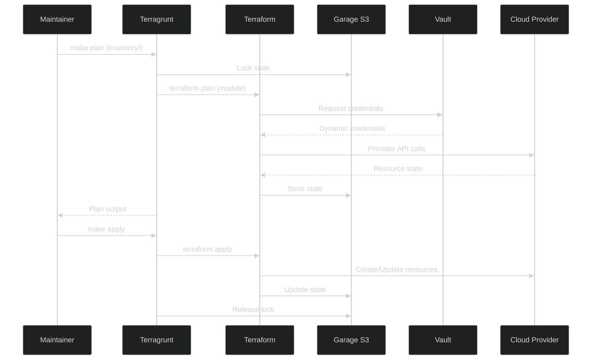
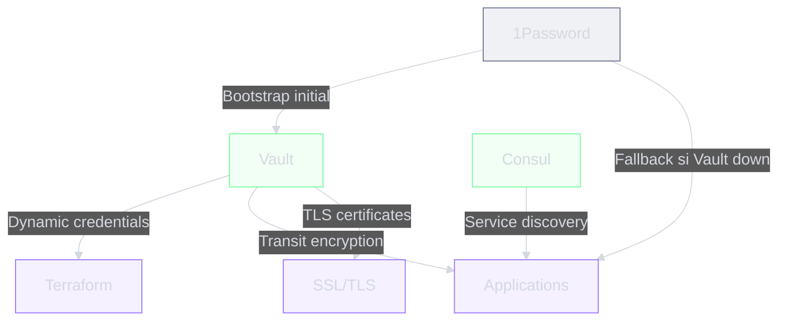
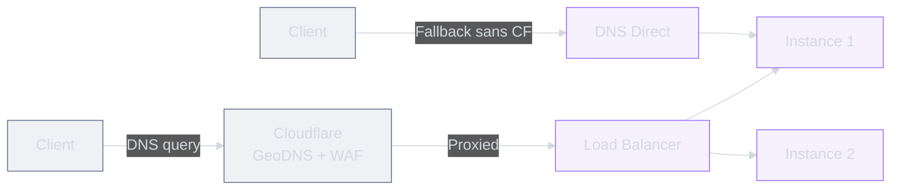

# Flux de donnees

## Deploiement



## Gestion des secrets



| Etape | Source | Destination | Protocole |
|-------|--------|-------------|-----------|
| Bootstrap | 1Password | Vault unseal + root token | `op://` CLI |
| Provider creds | 1Password | Vault | `op://` CLI |
| Dynamic creds | Vault | Terraform | HTTPS API (8200) |
| Discovery tokens | Consul | Applications | HTTP API (8500) |
| Fallback | 1Password | Applications | `op://` CLI |

## State Terraform

```text
State: Terraform → Garage S3 (mgmt.example.com:3900)
Lock:  Terraform → Consul KV (mgmt.example.com:8500)
```

Le backend est configure dans `inventory/config.hcl` :

- **Bucket** : `TF_STATE_BUCKET` sur Garage S3 (self-hosted, compatible AWS S3)
- **Lock** : Consul KV pour le locking distribue
- **Encryption** : Vault Transit pour le chiffrement at-rest

## DNS et Edge



Le template fonctionne avec **et** sans Cloudflare :

- **Avec Cloudflare** : GeoDNS, LB, WAF, SSL origin certificates
- **Sans Cloudflare** : DNS direct + Let's Encrypt pour SSL

## CI/CD

| Stage | Actions | Trigger |
|-------|---------|---------|
| **validate** | `terraform validate`, `tflint`, `ansible-lint` | Chaque push |
| **plan** | `terragrunt plan`, `infracost diff` | Chaque PR/MR |
| **test** | Terratest, Molecule | Chaque PR/MR |
| **apply** | `terragrunt apply` | Merge sur main |
| **drift** | Compare state vs reel | Cron quotidien |
| **cost** | Infracost report | Chaque PR/MR |
