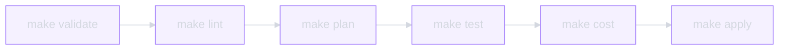

# Workflow de developpement

## Boucle principale



| Etape | Commande | Action |
|-------|----------|--------|
| 1 | `make validate` | `terraform validate` + `ansible --syntax-check` |
| 2 | `make lint` | `tflint` + `ansible-lint` |
| 3 | `make plan` | `terragrunt run-all plan` — preview des changements |
| 4 | `make test` | Terratest (Go) + Molecule (Python) |
| 5 | `make cost` | Infracost estimation pre-deploy |
| 6 | `make apply` | `terragrunt run-all apply` — deploiement |

## Nouveau produit

```bash
# 1. Clone le template
gh repo create mon-produit --template kodflow/infrastructure-template --private

# 2. Ouvre dans le DevContainer
cd mon-produit && code .

# 3. Remplis l'inventory
#    inventory/config.hcl    — backend Garage S3 + providers
#    inventory/providers.tfvars — providers actifs et parametres
#    inventory/stacks.tfvars   — stacks a deployer

# 4. Initialise et deploie
make init && make plan && make apply
```

## Tests

### Terraform (Terratest)

Chaque module Terraform a un test Go correspondant dans `tests/terratest/` :

1. `terraform init` + `apply` dans un workspace ephemere
2. Valide les outputs et l'etat reel des resources
3. `terraform destroy` en cleanup automatique

### Ansible (Molecule)

Chaque role Ansible a un scenario Molecule dans `tests/molecule/` :

1. Cree un container/VM ephemere
2. Applique le role
3. Verifie avec testinfra (assertions Python)
4. Detruit l'environnement

### Drift Detection

```bash
make drift  # Compare le state TF vs l'etat reel du provider
```

Execution quotidienne via cron CI. Alerte si divergence detectee entre le state et l'infrastructure reelle.

### Estimation des couts

```bash
make cost  # Infracost breakdown par stack
```

Genere un rapport de couts mensuels estimes. Poste automatiquement en commentaire PR/MR pour valider les impacts financiers avant merge.

## CI/CD

| Stage | Actions | Trigger |
|-------|---------|---------|
| **validate** | `terraform validate`, `tflint`, `ansible-lint` | Chaque push |
| **plan** | `terragrunt plan`, `infracost diff` | Chaque PR/MR |
| **test** | Terratest, Molecule | Chaque PR/MR |
| **apply** | `terragrunt apply` | Merge sur main |
| **drift** | Compare state vs reel | Cron quotidien |

Pipelines portables : GitHub Actions + GitLab CI. Configuration dans `ci/`.

## Synchronisation template

Les modules, stacks et pipelines se mettent a jour depuis le template upstream :

- **Synchronise** : `modules/`, `stacks/`, `ansible/`, `packer/`, `ci/`, `tests/`
- **Protege** : `inventory/`, `CLAUDE.md`, `.env*`, `Makefile`, `docs/`

Le versionning utilise `.infra-template-version` pour suivre la version du template appliquee.
