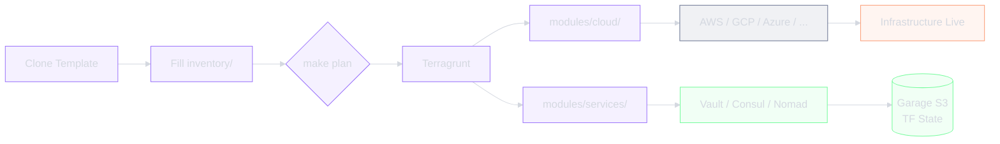

<!-- /docs-generated: {"date":"2026-02-19T15:45:00Z","commit":"fa79098","pages":10,"agents":9} -->

<div class="hero" markdown>

# infrastructure-template

**Template IaC reproductible sur 1000+ produits — seul l'inventory change.**

[Get Started :material-arrow-right:](#how-it-works){ .md-button .md-button--primary }

</div>

---

## Features

| Feature | Description |
|---------|-------------|
| **Provider-agnostic** | Modules abstraits pour AWS, GCP, Azure, Oracle Cloud, Hetzner, Heroku |
| **Inventory-driven** | Toute specificite produit dans `inventory/`, jamais dans les modules |
| **Management plane** | Vault + Consul + Nomad + Garage S3 + LDAP sur 3 serveurs (`mgmt.example.com`) |
| **Composition Terragrunt** | Les stacks composent des modules atomiques via Terragrunt dependencies |
| **Test everything** | Terratest (Go) pour Terraform, Molecule (Python) pour Ansible, Infracost pour les couts |
| **Fail-safe** | Fonctionne avec et sans Cloudflare, avec et sans management domain |
| **Multi-CI/CD** | GitHub Actions + GitLab CI portables |
| **Zero vendor lock-in** | 100% open source — HashiCorp, Ansible, Garage S3 |
| **Immutable images** | Packer bake les roles Ansible dans des images provider-specific (amd64 + arm64) |
| **Template sync** | `make update` synchronise les modules depuis le template sans ecraser `inventory/` |

## How it works



Le template fournit tous les modules Terraform, stacks Terragrunt, roles Ansible et pipelines CI/CD. Pour creer un nouveau produit, il suffit de cloner le template et de remplir le fichier `inventory/` avec la configuration specifique au produit. `make plan` puis `make apply` deploient l'infrastructure complete.

## Quick Start

1. **Cloner le template**
   ```bash
   gh repo create mon-produit --template kodflow/infrastructure-template --private
   ```
2. **Ouvrir dans le DevContainer**
   ```bash
   cd mon-produit && code .
   ```
3. **Remplir l'inventory**
   ```bash
   # inventory/config.hcl, inventory/providers.tfvars, inventory/stacks.tfvars
   ```
4. **Deployer**
   ```bash
   make init && make plan && make apply
   ```

---

*infrastructure-template · Open Source · [:material-github: GitHub](https://github.com/kodflow/infrastructure-template)*
